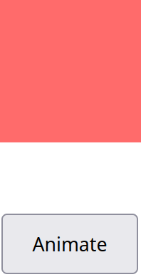
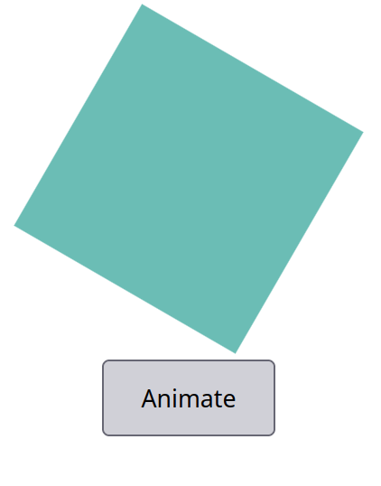
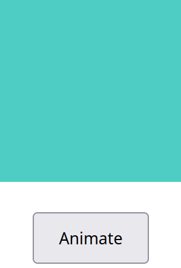

# AnimeJS

### 🚀 ¡Construcción de animaciones fluidas con AnimeJS! 🎮

En la búsqueda de desarrollar animaciones complejas, exploramos Anime.js, una librería ligera de JavaScript. Para demostrar su capacidad, he creado un _Proof of Concept_ (**PoC**) del uso de un botón para generar los efectos de rotación y una transición fluida de color.

### Ejemplo de animación

Iniciamos con la creación de nuestro archivo modelo index.html.

Procedemos implementando la etiqueta `<head>` con la importación de la librería Anime.js

```html
<!DOCTYPE html>
<html lang="en">
<head>
  <meta charset="UTF-8">
  <title>Anime.js PoC</title>
  <!--Importamos la librería-->
  <script src="https://cdnjs.cloudflare.com/ajax/libs/animejs/3.2.1/anime.min.js"></script>
  <!--Definimos el estilo inicial o estilo base de nuestra figura ".box" y del botón accionador-->
  <style>
    .box {
      width: 100px;
      height: 100px;
      background-color: #ff6b6b;
      margin: 50px auto;
      cursor: pointer;
    }
    button {
      display: block;
      margin: 20px auto;
      padding: 10px 20px;
    }
  </style>
</head>
...
```

Procedemos a definir el `<body>` de nuestra página html, implementando nuestro contenido por animar, junto a un script que habilitará el uso de esta nueva librería. 

```html
...
<!--Inicio del código-->>
<body>
  <!--Definimos nuestra figura-->
  <div class="box"></div>
  <!--Definimos el button y le adjuntamos la funcion toggleAnimation-->
  <button onclick="toggleAnimation()">Animate</button>

  <script>
    let isAnimating = false;

    // Configuración de animación
    const animation = anime({
      targets: '.box',
      rotate: '360deg',
      backgroundColor: '#4ecdc4',
      scale: 1.5,
      duration: 1000,
      easing: 'easeInOutQuad',
      autoplay: false,
      direction: 'alternate',
      loop: false
    });

    // Activación de la animación al hacer click
    function toggleAnimation() {
      if (!isAnimating) {
        animation.play();
        isAnimating = true;
      } else {
        animation.reverse();
        isAnimating = false;
      }
    }

  </script>
</body>
</html>
```

Como se observa, a través de los comentarios, nuestra contenedor de clase `.box` será actualizado tras presionar el botón que invoca `animation.play()`

### Funcionamiento del Ejemplo

Estado inicial:



Estado de transición:



Estado final:


